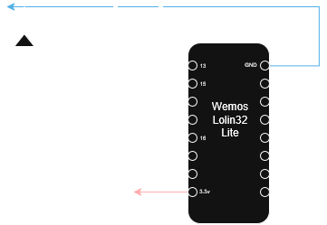

# PageTurnerMIDI - DIY Bluetooth MIDI Page Turner

**PageTurnerMIDI** is a DIY wireless page turner pedal for musicians. It uses an ESP32 microcontroller to transmit MIDI signals via Bluetooth Low Energy (BLE), allowing you to turn pages in apps like MobileSheets, forScore, and others that support MIDI mapping.

## ✨ Features

* **Wireless Connectivity:** Uses BLE MIDI for low latency and cable-free operation.
* **Dual Pedal Control:**
  * **DOWN Button:** Sends MIDI Note **(69)**.
  * **UP Button:** Sends MIDI Note **(70)**.
* **Status Indication:** LED indicator for connection status (Blinking = Waiting, Solid = Connected).
* **Reboot Function:** Hold both pedals simultaneously for 5 seconds to restart the device.
* **Custom Enclosure:** Laser-cut design files included for 9mm material.

## 🛠️ Hardware & Pinout

The project is built around an **ESP32** development board.

| Component | ESP32 Pin (GPIO) | Description |
| :--- | :--- | :--- |
| **Button DOWN** | 13 | Sends Note **69** (Next Page typically) |
| **Button UP** | 15 | Sends Note **70** (Previous Page typically) |
| **Status LED** | 16 | Visualization of connection state |

### Circuit Diagram

You can find the detailed circuit diagram in the `diagram/` folder.
Obs.: It was used a 100 ohm resistor for the LED, it could change according to the LED used.

## 📦 Enclosure / Case

The `laser-cut/` folder contains the design files for the pedal enclosure (Obs.: It was used a 9mm material).

* `page-turner.svg`: Vector file for laser cutting.
* `pedal-page-turner.lbrn2`: LightBurn project file.

## 🚀 Installation & Usage

1. **Hardware Assembly:** Follow the circuit diagram to connect the buttons and LED to your ESP32.
2. **Upload Firmware:**
    * Open the project (PlatformIO recommended or Arduino IDE).
    * Install the required libraries (e.g., `BLE-MIDI`).
    * Upload `src/PageTurnerMidi.ino` to your ESP32.
3. **Pairing:**
    * Power on the pedal. The LED should blink.
    * On your tablet/computer, search for Bluetooth devices.
    * Connect to **"PageTurner MIDI"**. The LED will stay solid ON.
4. **App Configuration:**
    * Open your sheet music app (e.g., MobileSheets).
    * Go to MIDI Settings.
    * Map MIDI Note **69** to "Scroll Down" or "Next Page".
    * Map MIDI Note **70** to "Scroll Up" or "Previous Page".
